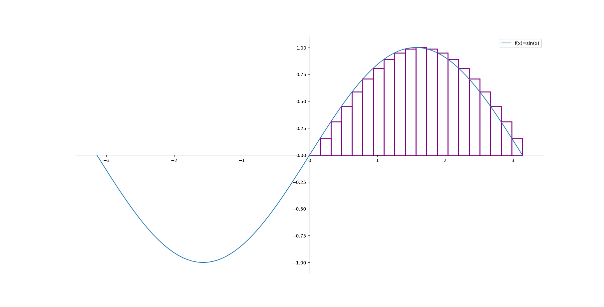
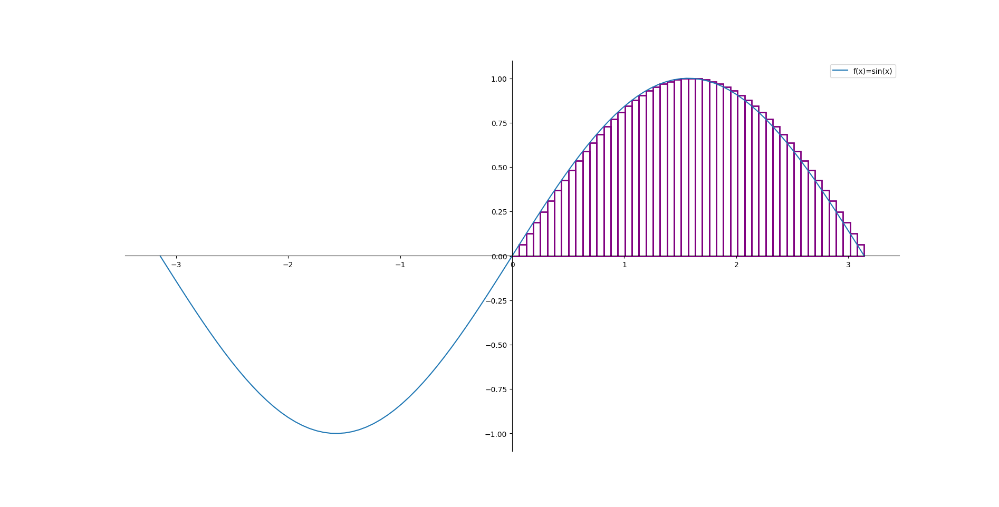
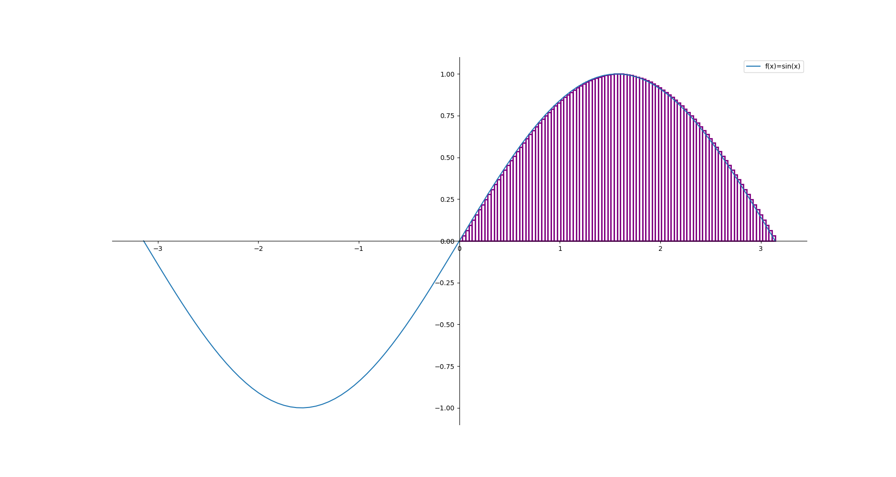

# Całkowanie numeryczne

## Opis problemu

Hasło "całkowanie numeryczne" może brzmieć strasznie, ale samo pojęcie jest dość proste do zrozumienia. To nic innego, niż policzenie pola pod wykresem funkcji w zadanym przedziale. Oczywiście w ogólności to zadanie jest dość skomplikowane obliczeniowo, dlatego tutaj skupimy się na przybliżeniu tej wartości.

Wyróżniamy dwie podstawowe metody: metodę prostokątów i metodę trapezów.

### Specyfikacja

#### Dane

* $f(x)$ — funkcja, której wykres nas interesuje
* $a$ — liczba rzeczywista, początek przedziału
* $b$ — liczba rzeczywista, koniec przedziału
* $n$ — liczba podziałów (im większa, tym większa dokładność)

#### Wynik

* $pole$ — przybliżona wartość pola pod wykresem funkcji $f(x)$ w przedziale $[a,b]$

## Rozwiązanie — metoda prostokątów

Idea tej metody jest prosta: podzielmy pole pod wykresem funkcji na prostokąty i policzmy ich pole.

### Wizualizacja

Zobaczmy, jak ta metoda działa na przykładzie. Spróbujmy oszacować pole pod wykresem funkcji sinus na przedziale od $0$ do $\pi$.

#### 20 prostokątów



#### 50 prostokątów



#### 100 prostokątów



### Pseudokod

```
funkcja MetodaProstokatow(f, a, b, n):
    1. pole := 0
    2. szer := (b - a) / n
    3. x := a + szer
    
    4. Dopóki x <= b, wykonuj:
        5. wys := f(x)
        6. pole := pole + szer * wys
        7. x := x + szer
        
    8. Zwróć pole
```

### Schemat blokowy

```mermaid
%%{init: {"flowchart": {"curve": "linear"}, "theme": "neutral"} }%%
flowchart TD
	START(["MetodaProstokatow(f, a, b, n)"]) --> K1["pole := 0\nszer := (b - a) / n\nx := a + szer"]
	K1 --> K4{x <= b}
	K4 -- PRAWDA --> K5["wys := f(x)\npole := pole + szer * wys\nx := x + szer"]
	K5 --> K4
	K4 -- FAŁSZ --> K8[/Zwróć pole/]
	K8 --> STOP([STOP])
```

## Rozwiązanie — metoda trapezów

W celu uzyskania lepszej dokładności, możemy podzielić pole pod wykresem funkcji na trapezy.

### Pseudokod

```
funkcja MetodaTrapezow(f, a, b, n):
    1. pole := 0
    2. szer := (b - a) / n
    3. x := a + szer
    
    4. Dopóki x <= b, wykonuj:
        5. pole := pole + ((f(x - szer) + f(x)) * szer) / 2
        6. x := x + szer

    7. Zwróć pole
```

### Schemat blokowy

```mermaid
%%{init: {"flowchart": {"curve": "linear"}, "theme": "neutral"} }%%
flowchart TD
	START(["MetodaTrapezow(f, a, b, n)"]) --> K1["pole := 0\nszer := (b - a) / n\nx := a + szer"]
	K1 --> K4{x <= b}
	K4 -- PRAWDA --> K5["pole := pole + ((f(x - szer) + f(x)) * szer) / 2\nx := x + szer"]
	K5 --> K4
	K4 -- FAŁSZ --> K8[/Zwróć pole/]
	K8 --> STOP([STOP])
```

## Implementacja

### C++


[numerical-integration.md](../../programming/c++/algorithms/numerical-methods/numerical-integration.md)


### Python


[numerical-integration.md](../../programming/python/algorithms/numerical-methods/numerical-integration.md)


### Kotlin


[numerical-integration.md](../../programming/kotlin/algorithms/numerical-methods/numerical-integration.md)
